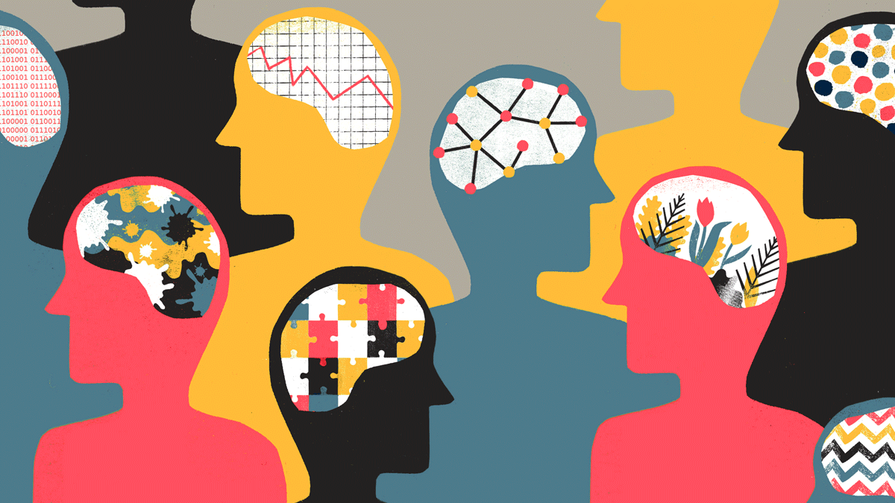
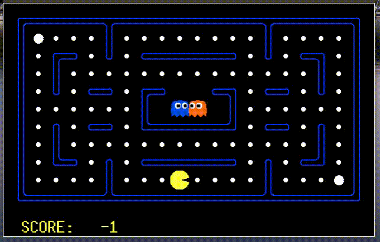
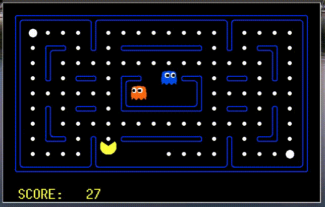
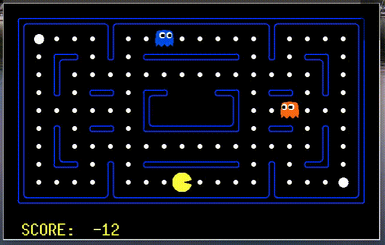
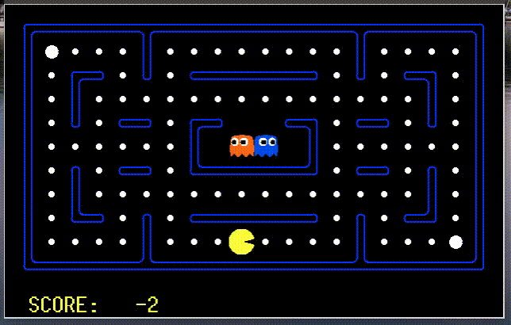
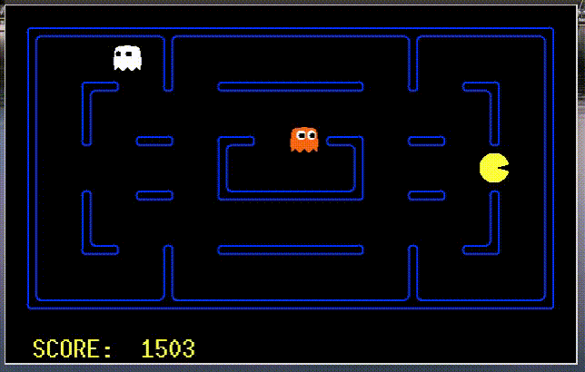
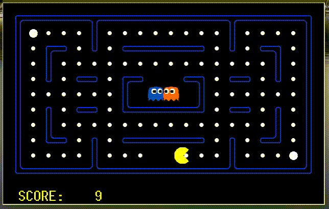
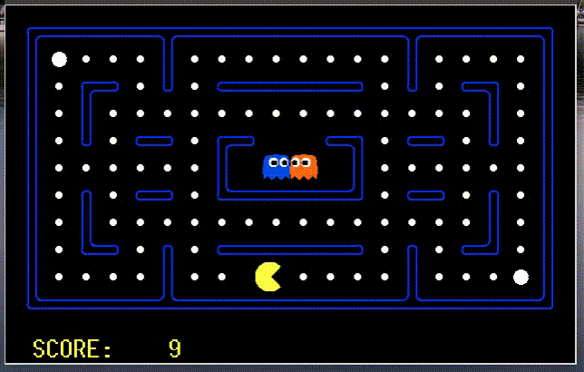
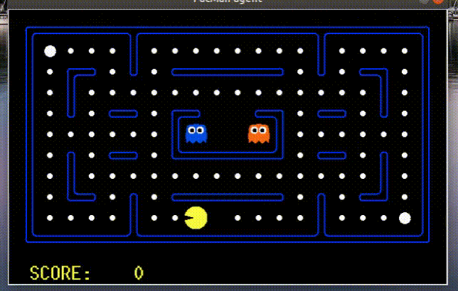

# mentalRL

(image credit to [HBR](https://hbr.org/2018/10/ais-potential-to-diagnose-and-treat-mental-illness))

 

Code for our paper: 

**"A Story of Two Streams: Reinforcement Learning Models from Human Behavior and Neuropsychiatry"** 

by [Baihan Lin](http://www.columbia.edu/~bl2681/) (Columbia), [Guillermo Cecchi](https://researcher.watson.ibm.com/researcher/view.php?person=us-gcecchi) (IBM Research), [Djallel Bouneffouf](https://scholar.google.com/citations?user=i2a1LUMAAAAJ&hl=en) (IBM Research), [Jenna Reinen](http://campuspress.yale.edu/jennareinen/) (IBM Research) and [Irina Rish](https://sites.google.com/site/irinarish/) (Mila, UdeM). 

For latest full paper: https://arxiv.org/abs/1906.11286

All the experimental results can be reproduced using the code in this repository. Feel free to contact me by doerlbh@gmail.com if you have any question about our work.

## Citation

If you find this work helpful, please try the models out and cite our work. Thanks!

    @article{lin2019mentalRL,
      title={{A Story of Two Streams: Reinforcement Learning Models from Human Behavior and Neuropsychiatry}},
      author={Lin, Baihan and Cecchi, Guillermo and Bouneffouf, Djallel and Reinen, Jenna and Rish, Irina},
      journal={arXiv preprint arXiv:1906.11286},
      year={2019}
    }

## Tasks

* MDP example with multi-modal reward distributions
* Iowa Gambling Task scheme 1 and 2
* PacMan game with different stationarities

## Requirements

* Python 3 for MDP and IGT tasks, and Python 2.7 for PacMan task.
* [PyTorch](http://pytorch.org/)
* numpy and scikit-learn

## Videos of mental agents playing PacMan

* AD ("Alzheimer's Disease")

* ADD ("addition")

* ADHD ("ADHD")

* bvFTD (the behavioral variant of Frontotemporal dementia)

* CP ("Chronic Pain")

* PD ("Parkinson's Disease")

* M ("moderate")

* SQL ("Split Q-Learning")

* PQL ("Positive Q-Learning")

* NQL ("Negative Q-Learning")

* QL ("Q-Learning")

* DQL ("Double Q-Learning")

## Acknowledgements 

The PacMan game was built upon Berkeley AI Pac-Man http://ai.berkeley.edu/project_overview.html. We modify many of the original files and included our comparison.

